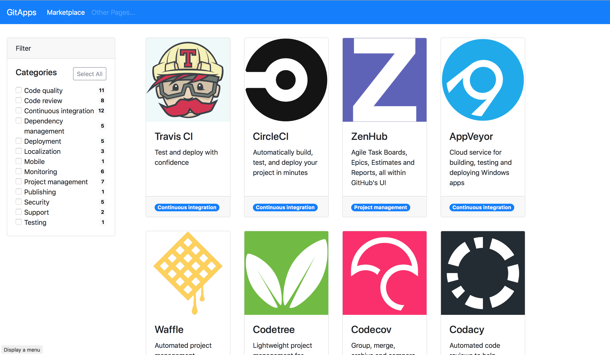

# Github Marketplace Client

A simple web app to explore Github Marketplace apps



## Setup

In order to run the app, you must add your own Github Personal Access Token with the Repo scope enabled. You will find an example environment file at `/src/environments/environment.example.ts`:

```
export const environment = {
    production: false,
    token: '*** Github Personal access token ***'
};
```

Modify that file with your own personal access token and save it as `/src/environments/environment.ts`. Once that is complete, you can build or serve the angular app. 

## Development server

Run `ng serve` for a dev server. Navigate to `http://localhost:4200/`. The app will automatically reload if you change any of the source files.

## Architecture

The client app is split into multiple components all delivered via a primary app component.

General directory structure (w/out html, css, or testing files):
```
app -->
  app.module.ts
  app.component.ts
  home -->
    home.component.ts
  shared -->
    nav -->
      nav.component.ts
  marketplace -->
    marketplace.component.ts
      filter -->
        filter.component.ts
      listing -->
        listing.component.ts
```

The app component houses the nav component along with a router-outlet that serves the home, marketplace, and listing components.

The marketplace component has the filter component as a child component, which delivers filtering updates. The filtering component requests all the marketplace `categories` from github to populate the options.

The app makes graphQL queries via [Apollo](https://www.apollographql.com/). The marketplace component runs an initial query of 20 marketplaces apps. As the user scrolls, they can request more via button - this updates the request and concatenates the results. As filtering is added, new requests are not made, rather filters are applied to the existing store of apps. If less than 20 marketplace apps exist once filtering has been applied, another request will be made (until all marketplace apps have been recieved).

## Conclusion

This was a fun excercise for me as it was the first time I got exposure to using graphQL. I really like how you can request specific data - it also seemed very fast. Apollo was an interesting interface, but sometimes it's documentation for Angular was difficult to follow. The examples also had all requests being made at the component level; I'm used to making reuqests at an extracted service level. I would definitely like to explore other graphQL interfaces in the future.
